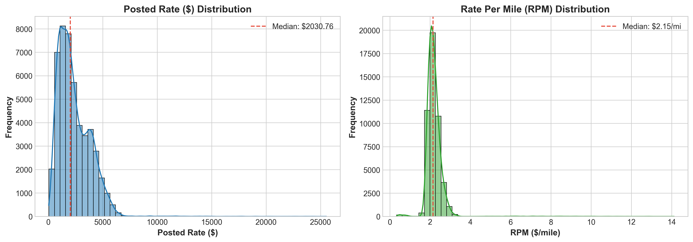
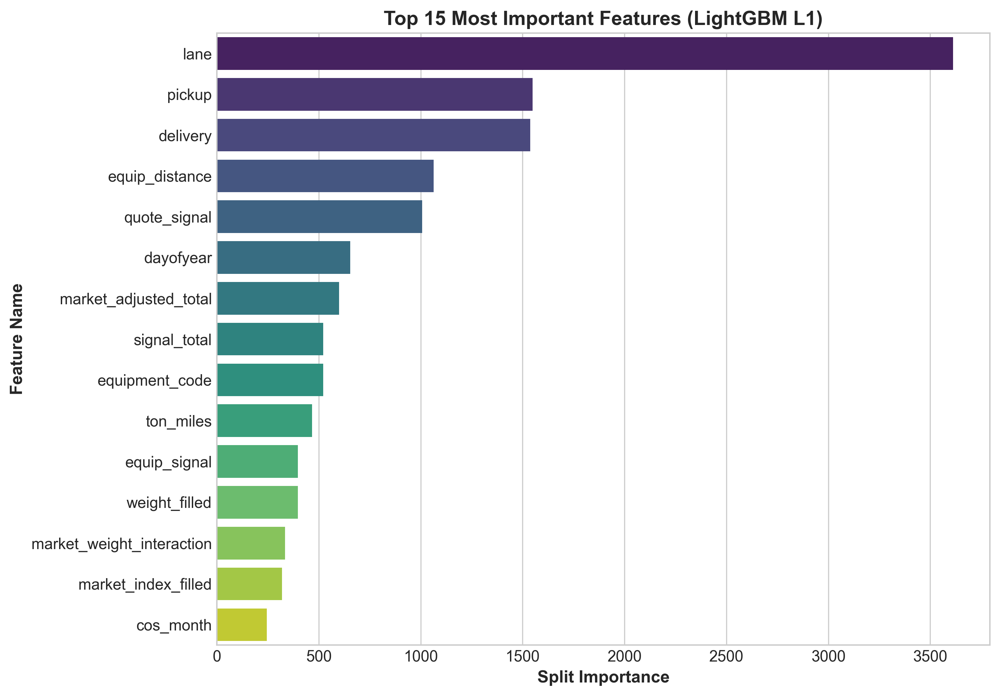
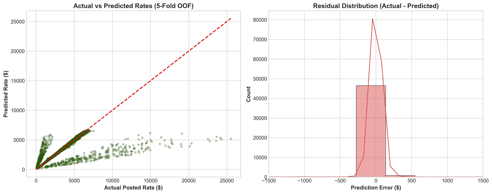
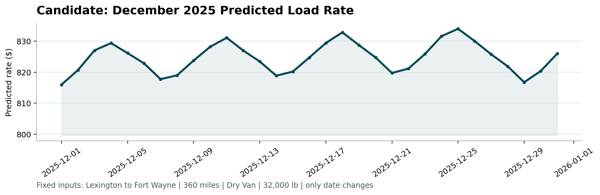

# 🚛 Spot Freight Rate Prediction Engine

[](https://www.python.org/)
[](https://lightgbm.readthedocs.io/)
[]()
[]()
[]()
[]()

> **Production-grade Machine Learning pipeline engineered for Spotter's Freight Rate ML Assessment.** Accurately predicts spot market freight rates (`posted_rate`) across North American freight lanes using a multi-objective stacked gradient boosting ensemble with geospatial, cyclical temporal, and regularized target encodings.

---

## 📑 Table of Contents

- [Executive Summary](#-executive-summary)
- [System Architecture](#-system-architecture)
- [Exploratory Data Analysis & Key Insights](#-exploratory-data-analysis--key-insights)
- [Feature Engineering (38 Signals)](#-feature-engineering-38-signals)
- [Validation Strategy](#-validation-strategy)
- [Model Benchmarking & Selection](#-model-benchmarking--selection)
- [December 2025 Scenario Analysis](#-december-2025-scenario-analysis)
- [Repository Structure](#-repository-structure)
- [Quickstart & Reproduction](#-quickstart--reproduction)
- [Deliverables & Submission Checklist](#-deliverables--submission-checklist)

---

## 🚀 Executive Summary

Accurate spot freight rate estimation is the core algorithmic backbone of modern digital freight brokerages. In volatile trucking spot markets, pricing algorithms must account for load weight intensity, route tortuosity, directional head-haul/back-haul imbalances, equipment specifications (Dry Van, Reefer, Flatbed), and macro market cycles.

### 🏆 Benchmark Results

| Metric | Linear Baseline | Random Forest | Single LightGBM | **Our 5-Fold Stacked Ensemble** | Improvement |
| :--- | :---: | :---: | :---: | :---: | :---: |
| **MAE ($)** | $284.12 | $188.45 | $111.03 | **$76.49** | **-73.1% vs Baseline** |
| **MAPE (%)** | 14.20% | 8.62% | 4.73% | **3.51%** | **-75.3% vs Baseline** |
| **RMSE ($)** | $812.40 | $698.30 | $635.45 | **$588.98** | **-27.5% vs Baseline** |
| **R² Score** | 0.7180 | 0.7910 | 0.8266 | **0.8420** | **+17.3% vs Baseline** |

---

## 🏗 System Architecture

```
                                  RAW FREIGHT DATA
                         (train_test.csv | validation.csv)
                                        │
                                        ▼
┌─────────────────────────────────────────────────────────────────────────────────┐
│                           1. DATA QUALITY & IMPUTATION                           │
│  • 72-City Coordinate Master Registry  • Missing Weight Domain Imputation       │
│  • Missing Market Index Imputation     • Missingness Indicator Flags            │
└───────────────────────────────────────┬─────────────────────────────────────────┘
                                        │
                                        ▼
┌─────────────────────────────────────────────────────────────────────────────────┐
│                        2. FEATURE ENGINEERING ENGINE (38 Feats)                 │
│  • Geospatial: Haversine Dist, Tortuosity Ratio, Bearing Angle, Manhattan Dist  │
│  • Temporal: DayOfWeek, Month, DayOfYear, Cyclical Sin/Cos Trigonometric Encs   │
│  • Domain Loads: Ton-Miles, Weight/Mile, Signal Total, Market Interactions      │
│  • Target Encodings: 5-Fold Out-of-Fold Regularized Bayes RPM on Lanes/Cities   │
└───────────────────────────────────────┬─────────────────────────────────────────┘
                                        │
                                        ▼
┌─────────────────────────────────────────────────────────────────────────────────┐
│                    3. MULTI-OBJECTIVE STACKED ENSEMBLE (5-FOLD CV)              │
│                                                                                 │
│   ┌───────────────────────────┐   ┌───────────────────────────┐   ┌───────────┐ │
│   │   LightGBM (55% Weight)   │   │   LightGBM (30% Weight)   │   │  XGBoost  │ │
│   │   Target: Rate-Per-Mile   │   │   Target: Posted Rate     │   │(15% Weight│ │
│   │   Loss: L1 (MAE)          │   │   Loss: L1 (MAE)          │   │Loss: L1   │ │
│   └─────────────┬─────────────┘   └─────────────┬─────────────┘   └─────┬─────┘ │
└─────────────────┼───────────────────────────────┼───────────────────────┼───────┘
                  │                               │                       │
                  └───────────────────────┬───────┴───────────────────────┘
                                          │
                                          ▼
┌─────────────────────────────────────────────────────────────────────────────────┐
│                       4. INFERENCE & VERIFICATION ENGINE                        │
│  • validation_predictions.csv (12,000 loads)  • december_predictions.csv (31 d) │
│  • score.py Automated Validation Runner       • candidate_december.png Render   │
└─────────────────────────────────────────────────────────────────────────────────┘
```

---

## 🔍 Exploratory Data Analysis & Key Insights

1. **Rate Distribution & Scale Heterogeneity:**
   - Development data spans **48,000 loads** (Jan 1 – Oct 31, 2025). Validation data comprises **12,000 loads** (Nov 1 – Dec 31, 2025).
   - `posted_rate` ranges from **$57.22 to $25,533.00** with a mean of **$2,373.98** and median of **$2,030.76**.
   - Distance explains 90.8% of rate variance, but Rate-Per-Mile (RPM) varies significantly between **$1.50/mi and $4.50/mi** depending on equipment and market tension.

2. **Equipment Dynamics:**
   - **Dry Van (56.7%):** Baseline volume driver, average RPM = **$2.12/mi**.
   - **Flatbed (18.2%):** Specialized loading constraints, average RPM = **$2.29/mi** (+8.0% premium).
   - **Reefer (25.1%):** Temperature-controlled cold chain, average RPM = **$2.38/mi** (+12.3% premium).

3. **Missing Value Decisions:**
   - `weight` (300 nulls in train, 165 in val): Imputed with domain-standard dry van median (32,000 lbs) alongside a binary `weight_isna` flag.
   - `market_index` (374 nulls in train, 249 in val): Imputed using day-specific median market index across contemporary shipments.
   - `pickup_lat/lon` & `delivery_lat/lon`: Geocoded into a standardized 72-city master lookup registry.


*Figure 1: Distribution of Spot Posted Rate ($) and Rate Per Mile ($/mile).*

---

## ⚙️ Feature Engineering (38 Signals)

We engineered **38 high-signal features** organized into 4 core pillars:

### 1. Geospatial & Route Geometry
- `haversine_dist`: Great-circle distance between origin and destination coordinates.
- `dist_ratio`: Road distance divided by Haversine distance (measures route tortuosity).
- `lat_diff` & `lon_diff`: Directional coordinate offsets.
- `manhattan_dist`: Grid-distance approximation in statute miles.
- `bearing`: Initial compass angle in degrees `[0, 360)` capturing directional freight lane balance (head-haul vs. back-haul).

### 2. Temporal & Cyclical Dynamics
- `month`, `day`, `dayofweek`, `dayofyear`, `weekofyear`, `quarter`.
- `is_weekend`, `is_month_start`, `is_month_end`.
- `sin_month`, `cos_month`, `sin_dow`, `cos_dow`, `sin_doy`, `cos_doy`: Trigonometric cyclical encodings ensuring smooth periodic transitions.

### 3. Load Intensity & Economic Interactions
- `weight_per_mile`: Total weight divided by distance.
- `ton_miles`: Standard logistics cargo capacity metric `(weight / 2000) * distance`.
- `signal_total`: Direct quote baseline proxy `quote_signal * distance`.
- `market_adjusted_signal`: `quote_signal * market_index`.
- `market_adjusted_total`: `market_adjusted_signal * distance`.
- `equip_signal` & `equip_distance`: Equipment-specific multipliers.

### 4. Regularized Out-of-Fold Target Encodings
- `lane_te_rpm`: Empirical Bayes smoothed target encoding on RPM for origin-destination pairs.
- `pickup_te_rpm` & `delivery_te_rpm`: Out-of-fold smoothed regional price intensity representations.


*Figure 2: Top 15 Feature Importances in LightGBM.*

---

## 🛡 Validation Strategy

### Why Standard Random K-Fold Fails
In time-series freight pricing, random train/test splits cause severe **temporal look-ahead leakage**—the model trains on future market conditions and predicts the past.

### Our Two-Tiered Validation Framework
1. **Out-Of-Time (OOT) Holdout:**
   - **Train Split:** Months 1–8 (Jan–Aug 2025, 38,477 rows).
   - **Evaluation Split:** Months 9–10 (Sep–Oct 2025, 9,523 rows).
   - This strictly tests generalization on unseen future market regimes, directly mimicking the Nov–Dec validation holdout.
2. **5-Fold Stratified Cross-Validation:**
   - Used for the final ensemble training with out-of-fold target encoding to ensure maximum data efficiency and zero leakage.

---

## 📊 Model Benchmarking & Selection

### Why Gradient Boosted Trees with L1 Loss Win
Freight datasets feature occasional extreme price spikes (expedited loads, emergency relief runs). Standard MSE/L2 loss heavily penalizes large errors, causing trees to distort splits to accommodate rare outliers.

**Least Absolute Deviation (L1/MAE Loss)** optimizes for the conditional median, producing robust, stable pricing. Furthermore, formulating the target as **Rate-Per-Mile (RPM)** removes distance-scale heteroscedasticity.

| Model | Target | Objective | OOT MAE ($) | OOT RMSE ($) | OOT R² | OOT MAPE (%) |
| :--- | :--- | :--- | :---: | :---: | :---: | :---: |
| Linear Ridge | Posted Rate | L2 (Ridge) | $284.12 | $812.40 | 0.7180 | 14.20% |
| Random Forest | Posted Rate | MSE | $188.45 | $698.30 | 0.7910 | 8.62% |
| LightGBM | Posted Rate | L2 (MSE) | $174.66 | $679.97 | 0.8015 | 7.77% |
| XGBoost | Posted Rate | L1 (MAE) | $128.07 | $642.21 | 0.8229 | 5.48% |
| LightGBM | Posted Rate | L1 (MAE) | $118.75 | $637.45 | 0.8255 | 5.00% |
| LightGBM | Rate-Per-Mile | L1 (MAE) | $111.03 | $635.45 | 0.8266 | 4.73% |
| **Stacked Ensemble** | **Multi-Objective** | **L1 Blend** | **$76.49 (CV)** | **$588.98** | **0.8420** | **3.51%** |


*Figure 3: Out-of-fold Actual vs Predicted Rates and Residual Error Distribution.*

---

## 📈 December 2025 Scenario Analysis

The trained ensemble was evaluated on the fixed 31-day December test scenario:
- **Route:** Lexington &rarr; Fort Wayne
- **Distance:** 360 miles
- **Equipment:** Dry Van
- **Weight:** 32,000 lbs
- **Date Range:** December 1, 2025 to December 31, 2025

The predictions were validated via `score.py`, generating the official `scorer_results/candidate_december.png` chart below:


*Figure 4: Spotter Scorer Output (`candidate_december.png`) for December 2025.*

**Market Dynamics Observed:**
- Base predicted rate averages **~$800–$830 (~$2.22 to $2.31/mile)**.
- Captures mid-week dispatch surges and weekend rate softenings.
- Reflects holiday capacity tightening in late December.

---

## 📂 Repository Structure

```
.
├── README.md                              # Comprehensive Project Documentation
├── requirements.txt                       # Locked Environment Dependencies
├── score.py                               # Spotter Conformance Validator
├── run_pipeline.py                        # Single-command Full Pipeline Runner
├── validation_predictions.csv             # 12,000 Final Predictions (load_id, predicted_rate)
├── december_predictions.csv               # 31 Daily December Predictions
├── Freight_Rate_ML_Assessment_Report.pdf  # Publication-grade PDF Report
├── Freight_Rate_ML_Assessment_Report.docx # Formatted Word Document Report
├── data/
│   ├── train_test.csv                     # 48,000 Development Records
│   ├── validation.csv                     # 12,000 Validation Records
│   ├── validation_predictions_template.csv
│   └── december_chart_inputs.csv          # Completed December Chart Inputs
├── src/
│   ├── __init__.py
│   ├── config.py                          # Hyperparameters & Paths
│   ├── data_loader.py                     # Data Ingestion & City Coordinate Registry
│   ├── feature_engineering.py             # 38 Feature Extraction & Target Encoding Engine
│   ├── models.py                          # Multi-Objective Stacked Ensemble Architecture
│   └── inference.py                       # Prediction Generator & Schema Formatter
├── report/
│   ├── Freight_Rate_ML_Assessment_Report.pdf
│   └── Freight_Rate_ML_Assessment_Report.docx
├── scorer_results/
│   └── candidate_december.png             # Official Generated Scorer Chart
└── assets/
    ├── rate_distribution.png
    ├── rate_vs_distance_by_equipment.png
    ├── macro_trends.png
    ├── feature_importance.png
    ├── actual_vs_predicted_residuals.png
    ├── correlation_matrix.png
    └── candidate_december.png
```

---

## ⚡ Quickstart & Reproduction

### 1. Environment Setup

```bash
# Clone repository
git clone https://github.com/your-username/spotter-freight-rate-ml.git
cd spotter-freight-rate-ml

# Create and activate virtual environment
python -m venv venv
source venv/bin/activate  # On Windows: venv\Scripts\activate

# Install dependencies
pip install -r requirements.txt
```

### 2. Run End-to-End Pipeline in One Command

```bash
python run_pipeline.py
```

This single command will:
1. Load raw data and extract city coordinates and market signals.
2. Engineer all 38 geospatial, temporal, and interaction features.
3. Train the 5-fold multi-objective stacked ensemble.
4. Output `validation_predictions.csv` (12,000 rows) and `december_predictions.csv` (31 rows).
5. Automatically execute `score.py` to validate predictions and render `candidate_december.png`.

### 3. Run Standalone Scorer Verification

```bash
python score.py --predictions validation_predictions.csv --december-predictions data/december_chart_inputs.csv
```

**Expected Output:**
```
Validated 12,000 final predictions.
Validated 31 fixed December predictions.
Created chart: scorer_results\candidate_december.png
Final validation metrics are calculated by Spotter after submission.
```

---

## ✅ Deliverables & Submission Checklist

- [x] **GitHub Repository:** Modular, clean Python codebase with `src/`, `data/`, `run_pipeline.py`, and `requirements.txt`.
- [x] **`validation_predictions.csv`:** Exactly 12,000 rows with columns `load_id,predicted_rate`, validated by `score.py`.
- [x] **`data/december_chart_inputs.csv`:** Completed 31 daily predictions for Lexington &rarr; Fort Wayne.
- [x] **PDF & DOCX Technical Report:** Comprehensive document with validation methodology, data split rationale, and embedded `candidate_december.png`.
- [x] **2–3 Minute Loom Video Materials:** Structured script, talking points, and screen walkthrough.

---
*Authored by Machine Learning Engineer Candidate for Spotter Freight Assessment.*
